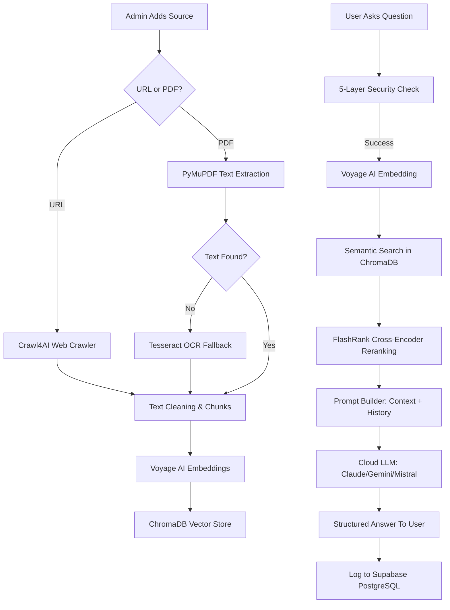

# SiteSense AI - System Documentation

SiteSense AI is a state-of-the-art multi-tenant RAG (Retrieval-Augmented Generation) chatbot platform. It allows businesses to create custom AI assistants by ingesting their own data (websites, documents) and embedding a chat widget directly into their site.

---

## 🛠 Tech Stack

### Backend (Python)
- **Core Framework**: [FastAPI](https://fastapi.tiangolo.com/) (Async, high-performance)
- **RAG Framework**: [LlamaIndex](https://www.llamaindex.ai/) (Data ingestion, chunking, and querying)
- **LLM Provider**: Multi-provider support for [Anthropic Claude](https://anthropic.com), [Google Gemini](https://ai.google.dev), and [Mistral AI](https://mistral.ai) (Cloud APIs)
- **Embeddings**: [Voyage AI](https://voyageai.com/) (State-of-the-art retrieval performance)
- **Vector Database**: [ChromaDB](https://www.trychroma.com/) (Vector storage and retrieval)
- **Primary Database**: [Supabase PostgreSQL](https://supabase.com/) (Multi-tenant metadata and conversation logs)
- **Authentication**: [Supabase Auth](https://supabase.com/docs/guides/auth) (JWT-based secure admin access)
- **Web Scraping**: [Crawl4AI](https://crawl4ai.com/) (Advanced markdown extraction for websites)
- **Document Processing**: [PyMuPDF](https://pymupdf.readthedocs.io/) and OCR (Tesseract) for PDF extraction
- **Reranking**: [FlashRank](https://github.com/PrithivirajDamodaran/FlashRank) (Cross-encoder reranking for higher accuracy)

### Frontend (Modern Web)
- **Framework**: [Next.js 16](https://nextjs.org/) (React 19)
- **Styling**: [Tailwind CSS 4](https://tailwindcss.com/)
- **UI Components**: [Shadcn/UI](https://ui.shadcn.com/) (Premium, customized components)
- **Analytics Visualization**: [Recharts](https://recharts.org/)
- **State Management**: React Hook Form + Zod (Validation)
- **Icons**: [Lucide React](https://lucide.dev/)

---

## 🏛 System Architecture

The platform follows a modular, async-first architecture divided into four primary layers:

### 1. The Authentication Layer (New)
The Admin Portal is protected by **Supabase Auth**. All requests to backend administrative routes require a verified `Bearer` JWT. This ensures that users can only access and modify their own bot configurations and analytics.

### 2. The Management Layer (Admin Portal)
Users manage their AI infrastructure through a secure dashboard:
- **Bot Strategy**: Choose specialized LLM models (Claude/Gemini/Mistral) per bot.
- **Security Control**: Manage "Allowed Origins" (Domain Whitelisting) for the chat widget.
- **Provider Keys**: Securely configure and store encrypted API keys for different AI services.
- **Insights**: Monitor detailed conversation logs, token usage, and active provider stats.

### 3. The Ingestion Layer (Pipeline)
- **Extraction**: Clean Markdown is pulled from URLs via `Crawl4AI` or text is extracted from PDFs via `PyMuPDF`.
- **Chunking**: Text is split into semantically meaningful chunks using LlamaIndex.
- **Embedding**: Chunks are converted to high-dimensional vectors using **Voyage AI** (voyage-02).
- **Storage**: Chunks are stored in **ChromaDB**, scoped by tenant ID for isolation.

### 4. The Inference Layer (RAG & Security)
When a user asks a question via the widget:
- **Security (5-Layer)**: The request is validated against the origin domain, and a short-lived, session-bound JWT is issued to prevent unauthorized API calls or bot "kidnapping".
- **Search & Rerank**: The system performs a similarity search in ChromaDB and reranks top candidates using `FlashRank`.
- **Generation**: The selected Cloud LLM generates a response within a strictly scoped prompt (No Hallucinations).
- **Logging**: The conversation, token count, and active provider are logged to **Supabase** for analytics.

---

## 📈 Entire Ingestion & Chat Pipeline

---

## 💡 Key Features
- **Multi-Tenant Support**: Each bot operates in its own isolated environment with dedicated context.
- **Advanced Security**: Domain-bound JWT session tokens protect your API from being used on unauthorized sites.
- **Multi-Model Intelligence**: Switch between Anthropic, Google, or Mistral models based on your bot's specific needs.
- **Enterprise-Grade Embeddings**: Uses Voyage AI for drastically better retrieval accuracy compared to open-weight models.
- **Zero Hallucination**: RAG pipeline ensures answers are derived strictly from your provided knowledge base.
- **Lead Generation**: Captures user data and tracks knowledge gaps for continuous improvement.
