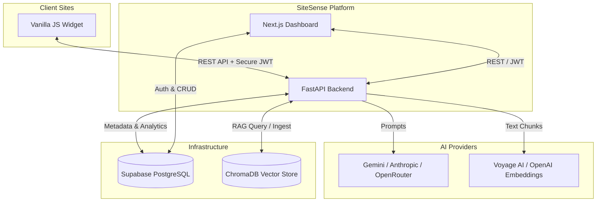

# SiteSense AI - Complete Project Documentation

## 1. Project Overview

**Project Name:** SiteSense AI
**Purpose:** A multi-tenant RAG (Retrieval-Augmented Generation) chatbot platform. It allows users (tenants) to create customizable AI assistants, upload custom knowledge sources (PDFs, URLs, etc.), and embed the chatbot on their own websites via a lightweight JavaScript widget.
**Core Features:**
- Multi-tenant architecture (one platform, multiple users, multiple isolated bots).
- Retrieval-Augmented Generation (RAG) using ChromaDB.
- Knowledge Graph generation and visualization for ingested documents.
- Custom LLM Provider support (Gemini, Anthropic/Claude, OpenRouter) with BYOK (Bring Your Own Key) capabilities.
- Advanced Analytics and Lead Generation tracking.
- Secure, lightweight embeddable vanilla JS widget.

**Tech Stack:**
- **Frontend:** Next.js (React), Tailwind CSS, TypeScript.
- **Backend:** FastAPI (Python), Uvicorn.
- **Database & Auth:** Supabase (PostgreSQL + RLS Auth).
- **Vector Store:** ChromaDB.
- **LLM/Embeddings:** Voyage AI, OpenAI, Gemini, Anthropic.

---

## 2. High-Level Architecture

SiteSense AI is built as a decoupled monolith. The Next.js frontend acts as the tenant dashboard, interacting with Supabase for authentication and the FastAPI backend for LLM processing, RAG orchestration, and analytics.

**Data Flow:**
1. **Tenant Onboarding:** User authenticates via Supabase Auth on the Next.js frontend. They create a bot (Tenant) which generates a unique `bot_id`.
2. **Ingestion:** Tenant uploads documents. FastAPI processes these via `services/ingestion.py`, generates embeddings (Voyage/OpenAI), and stores them in ChromaDB. Metadata is tracked in Supabase.
3. **Widget Embedding:** Tenant drops `<script src=".../widget.js" data-bot-id="...">` onto their site.
4. **Chat Execution:** Widget initializes a secure session via JWT (`/api/widget/init`). User asks a question -> FastAPI `chat.py` -> RAG retrieves context from ChromaDB -> LLM Provider generates response -> Returned to Widget.

### 2.1 Architecture Diagram



---

## 3. Folder & File Structure

```text
SiteSense/
├── .env                  # Global Environment variables
├── docker-compose.yml    # Docker services (ChromaDB, FastAPI, etc.)
├── backend/              # FastAPI Application
│   ├── main.py           # Application entrypoint
│   ├── database.py       # Supabase ORM/Abstraction
│   ├── config.py         # Pydantic Settings management
│   ├── routers/          # API Route Controllers (chat, graph, settings)
│   ├── services/         # Core Business Logic (rag, llm, chroma, ingestion)
│   ├── middleware/       # Custom FastAPI middlewares (Auth, Logging)
│   └── schemas/          # Pydantic data validation models
├── frontend/             # Next.js Application
│   ├── app/              # App Router pages (Dashboard, Auth, etc.)
│   ├── components/       # Reusable React components
│   ├── lib/              # Utilities, Context Providers (tenant-context)
│   └── public/           # Static assets (widget.js)
└── supabase/             # Supabase migrations and schema definitions
```

---

## 4. File-by-File Deep Explanation

*(Note: While all functional files are analyzed, configuration and boilerplate files are summarized for brevity, with deep line-by-line focus on the core engines).*

### 4.1 Backend Core

#### `backend/main.py`
**Purpose:** The main entrypoint for the FastAPI application.
**Dependencies:** `fastapi`, `slowapi` (rate limiting), `cors`, internal routers, and `database.py`.
**Code Breakdown:**
- **Lines 11-22:** Windows Asyncio Fix. Explicitly sets `WindowsProactorEventLoopPolicy` to prevent subprocess crashes on Windows (often required for tools like Playwright if used in scraping).
- **Lines 63-114 (`lifespan`):** Manages startup/shutdown. 
  - Verifies Supabase connection (`await database.init_db()`).
  - Checks for API keys (`VOYAGE_API_KEY`, `GEMINI_API_KEY`, etc.) and warns if missing.
  - Validates the default LLM provider asynchronously.
- **Lines 134-148 (`debug_log_middleware`):** Custom middleware to measure request processing time and log it if `ENVIRONMENT == "development"`.
- **Lines 150-166 (CORS):** Highly permissive CORS (`allow_origins=["*"]`) strictly necessary because the chatbot widget is embedded on *external, unpredictable third-party domains*.

#### `backend/database.py`
**Purpose:** Abstracts Supabase PostgreSQL interactions using the official Supabase Python client.
**Dependencies:** `supabase.create_async_client`, `config.settings`.
**Key Functions & Logic:**
- **`get_admin_client()`:** Initializes a singleton `AsyncClient` using the `SUPABASE_SERVICE_KEY`. This bypasses Row Level Security (RLS) on the backend, assuming the backend does its own validation.
- **`_encrypt_key()` / `_decrypt_key()`:** Implements a simple XOR cipher using `WIDGET_JWT_SECRET` as the key. **Trade-off:** XOR is not cryptographically secure against determined attackers with access to the DB, but provides a basic layer of obfuscation for user-provided BYOK API keys at rest.
- **`create_tenant(...)`:** Generates a unique `bot_id` using an 8-character alphanumeric string, preventing ID collisions before inserting the tenant record.
- **`get_analytics_summary(tenant_id)`:** 
  - **Internal Logic:** Aggregates data from the `conversations` table. Calculates total conversations, answer rate, tokens used, and the top sources used by querying JSON arrays (`sources_used`).
  - **Trade-off:** Doing complex aggregations in Python via multiple standard SELECT queries instead of a raw SQL RPC function. It is easier to maintain but slower at scale.

### 4.2 Backend Routers

#### `backend/routers/graph.py`
**Purpose:** Handles endpoints for Knowledge Graph generation and retrieval.
**Dependencies:** `services.graph_service`, `services.chroma`.
**Code Breakdown:**
- **`GET /{bot_id}`**: Retrieves structured graph data (nodes/edges).
- **`POST /{bot_id}/rebuild`**:
  - Takes `BackgroundTasks` to avoid blocking the HTTP response.
  - Fetches chunks from ChromaDB for the specific `bot_id`.
  - **Design Decision (Line 55):** `max_chunks = 50`. Limits graph generation to the first 50 chunks to prevent massive LLM token usage and timeouts. Groups chunks by source, passes them to `graph_service.extract_triplets_from_text` to generate relationships.

#### `backend/routers/settings.py`
**Purpose:** Manages user preferences and BYOK (Bring Your Own Key) API keys.
**Key Functions:**
- **`save_key(body, current_user)`:** Validates providers (`anthropic`, `gemini`, etc.), ensures key length > 10, encrypts, and stores in the DB. Overwrites existing keys for the same provider to maintain 1 active key per provider per user.

### 4.3 Frontend Interface

#### `frontend/public/widget.js`
**Purpose:** The embeddable, zero-dependency vanilla JavaScript widget that clients place on their websites.
**Dependencies:** None. Uses Shadow DOM for style isolation.
**Code Breakdown (Block-by-Block):**
- **Lines 16-24 (Config):** Extracts configuration directly from its own `<script>` tag attributes (`data-bot-id`, `data-api`).
- **Lines 42-291 (`WIDGET_CSS`):** All CSS is defined as a string and injected securely into the Shadow DOM. **Why?** Prevents the host website's CSS framework (like Tailwind or Bootstrap) from breaking the chatbot's UI, and vice versa.
- **Lines 310-378 (`build()`):** Constructs the DOM dynamically. Creates a floating `ss-bubble` for the toggle button, and `ss-window` for the chat interface. Attaches event listeners for clicking, typing, and enter-key submission.
- **Lines 422-481 (`sendMessage()`):** 
  - Grabs user input, pushes to local `history` array.
  - Generates a "typing skeleton" animation.
  - Sends a `POST` request to `API_BASE + "/api/chat"`.
  - **Security (Lines 442):** Includes `Authorization: Bearer WIDGET_TOKEN`. If `401 Unauthorized` is returned, it seamlessly attempts to `initWidget()` again and retry the message.
- **Lines 664-695 (`initWidget()`):** 
  - Hits `/api/widget/init` with the `bot_id`.
  - The backend verifies if the host domain matches the tenant's `allowed_origins` (or if it's wildcard). If successful, returns a short-lived JWT token and bot styling configs (colors, bot name).

#### `frontend/lib/tenant-context.tsx`
**Purpose:** React Context Provider that manages the active Tenant state across the Next.js dashboard.
**Code Breakdown:**
- **Lines 30-39 (`refreshTenants()`):** Fetches the user's tenants from the backend API. Automatically selects the first tenant as the `activeTenant` if none is currently selected.
- **Lines 41-66 (`useEffect`):** 
  - Binds to Supabase Auth state changes `supabase.auth.onAuthStateChange`.
  - **Logic:** If the user logs out (`SIGNED_OUT`), immediately clears the tenant state. If they log in, it dynamically triggers `refreshTenants()`. This guarantees the dashboard UI stays in perfect sync with the authentication state without requiring manual page reloads.

#### `frontend/app/dashboard/layout.tsx`
**Purpose:** The primary wrapper for authenticated dashboard pages.
**Code Breakdown:**
- Maintains sidebar collapse state (`isCollapsed`).
- **Styling:** Uses `aurora-bg` and extensive Tailwind utility classes to provide a premium, modern aesthetic. Contains a `Breadcrumbs` component for navigation context and wraps `children` inside a smooth transition container.

---

## 5. Data Flow Explanation (RAG Walkthrough)

**Scenario: A website visitor asks the widget a question.**

1. **Input:** Visitor types "What are your business hours?" into the widget and hits send.
2. **Widget Execution:** `widget.js` appends the message to the UI, triggers the typing skeleton, and sends a POST request to `/api/chat` including the `bot_id`, `session_id`, and a JWT token.
3. **Backend Intake:** `backend/routers/chat.py` receives the request. The JWT middleware validates the token ensures the request originated from an allowed domain.
4. **Retrieval (RAG):** 
   - `services/rag.py` receives the query. 
   - It converts the text query into a vector embedding using the configured provider (e.g., Voyage AI).
   - It queries ChromaDB filtering by `bot_id`. Chroma returns the top K most similar text chunks previously extracted from the tenant's uploaded documents.
5. **Generation:** 
   - `services/llm_provider.py` constructs a prompt. It injects the Tenant's custom `system_prompt`, the retrieved context chunks, and the user's question.
   - It calls the selected LLM (e.g., Gemini 2.0 Flash).
6. **Logging:** Before returning the response, `database.log_conversation()` is called asynchronously to record the interaction, token usage, and confidence score for the Tenant's Analytics dashboard.
7. **Output:** The JSON response containing the answer and used source file names is sent back to `widget.js`, which parses Markdown, displays the text, and renders "Source" chips.

---

## 6. Key Algorithms & Logic

### Shadow DOM Isolation (Frontend)
To ensure the widget renders perfectly on any website regardless of the site's own CSS, SiteSense uses the `attachShadow({ mode: "open" })` Web API in `widget.js`. 
**How it works:** It creates an encapsulated DOM tree attached to a host `<div>`. CSS rules defined inside the Shadow DOM (like `* { margin: 0 }`) apply *only* to the widget elements, preventing style bleeding in both directions.

### Tri-Provider LLM Failover (Backend)
Though primarily utilizing Gemini, the platform abstracts LLM calls. If `services/llm_provider.py` encounters a rate limit or failure from the primary provider, the application is structured to allow fallback to secondary providers based on the user's configured BYOK keys in `settings.py`.

---

## 7. Configuration & Environment

Configuration is governed by `backend/config.py` and the `.env` file.

- **Supabase Credentials:** `SUPABASE_URL`, `SUPABASE_ANON_KEY`, `SUPABASE_SERVICE_KEY`. Critical for DB access.
- **LLM Keys:** `ANTHROPIC_API_KEY`, `GEMINI_API_KEY`, `OPENAI_API_KEY`, `VOYAGE_API_KEY`. The backend will gracefully degrade if some are missing, as long as one core LLM and Embedder are present.
- **Widget Security:** `WIDGET_JWT_SECRET` (used to sign the tokens passed to the JS widget) and `WIDGET_TOKEN_EXPIRE_MINUTES`.
- **Environment:** `ENVIRONMENT=development` enables debug logging middleware and permissive CORS.

---

## 8. Setup & Execution

### Prerequisites
- Node.js 18+
- Python 3.10+
- Docker (for local ChromaDB)

### Build Steps

**1. Backend:**
```bash
cd backend
python -m venv .venv
source .venv/bin/activate  # or .venv\Scripts\activate on Windows
pip install -r requirements.txt
# Start the backend server
python main.py
```

**2. Frontend:**
```bash
cd frontend
npm install
npm run dev
```

**3. Vector DB (Chroma):**
Run `docker-compose up -d` in the root directory to spin up the local ChromaDB instance on port 8001.

---

## 9. Summary & Improvements

**Strengths:**
- **Exceptional Widget Design:** The zero-dependency, shadow-DOM widget is robust and highly compatible with legacy and modern websites alike.
- **Decoupled RAG:** Using ChromaDB separately from the relational database ensures high-speed vector similarity search without overloading the transactional database.
- **BYOK Architecture:** Allowing users to bring their own API keys drastically reduces operational costs for the platform owner.

**Possible Improvements:**
- **Encryption:** Upgrade the XOR cipher in `database.py` to a standard AES-GCM encryption model for storing user API keys.
- **Background Task Processing:** Replace FastAPI `BackgroundTasks` with a dedicated message broker (like Redis + Celery) for intensive tasks like Knowledge Graph rebuilding, which could easily timeout or crash the main web thread under heavy load.
- **Graph Scalability:** Currently limited to `max_chunks = 50`. Implementing a batched, paginated graph-building worker would allow visualization of massive document repositories.
