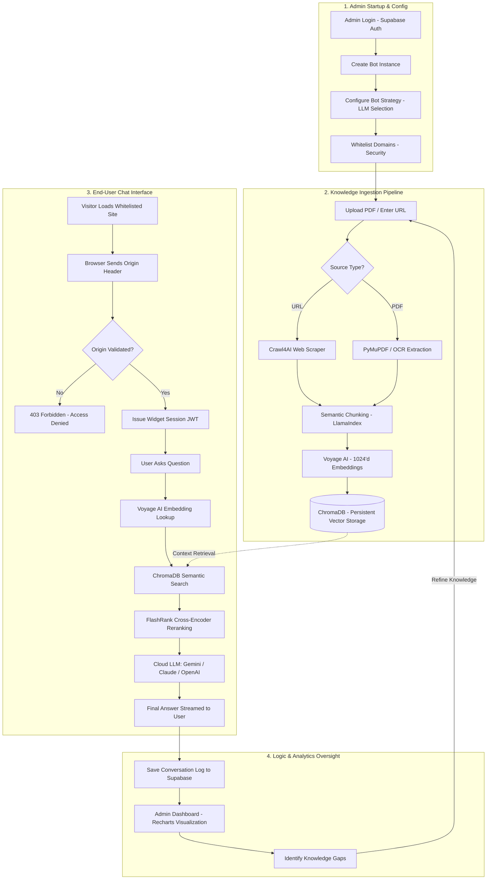

# 🚀 SiteSense AI — Comprehensive Technical Documentation

SiteSense AI is a premium, multi-tenant **Retrieval-Augmented Generation (RAG)** platform designed to transform static websites and documents into intelligent, interactive AI assistants. It provides businesses with a seamless way to ingest their knowledge base and deploy a secure, domain-bound chat widget in minutes.

---

## 📑 Table of Contents
1. [Project Overview](#project-overview)
2. [Detailed Tech Stack](#detailed-tech-stack)
3. [Project Pipeline & Flow](#project-pipeline--flow)
4. [The Full Ecosystem Visual (Mermaid)](#the-full-ecosystem-visual-mermaid)
5. [Authentication & Security](#authentication--security)
6. [Data Privacy Policy](#data-privacy-policy)
7. [Tools & Infrastructure](#tools--infrastructure)
8. [Advanced Engineering Details](#advanced-engineering-details)

---

## 🗺️ The Full Ecosystem Visual (Mermaid)

Below is the complete architectural flow showing how an organization goes from setup to a live, secure AI assistant.

---

## 🌟 Project Overview

**SiteSense AI** solves the "hallucination problem" of standard LLMs by grounding responses in a specific knowledge base. 

### Core Capabilities:
*   **Intelligent Ingestion**: Automatically crawls websites and processes complex PDFs/Excels.
*   **Multi-Model Strategy**: Allows admins to switch between Claude-3, Gemini-1.5, and OpenAI.
*   **Security First**: Implements domain-whitelisting and short-lived session tokens for the widget.
*   **Advanced Analytics**: Tracks user queries, captures leads, and identifies "Knowledge Gaps" where the bot couldn't answer.

---

## 🛠 Detailed Tech Stack

### **Frontend** (Admin Portal & Widget)
*   **Framework**: [Next.js 16 (App Router)](https://nextjs.org/) — Utilizing Server Components for performance.
*   **UI System**: [Shadcn/UI](https://ui.shadcn.com/) with [Tailwind CSS 4](https://tailwindcss.com/) for a premium, responsive design.
*   **Visualization**: [Recharts](https://recharts.org/) for real-time analytics dashboards.
*   **State & Logic**: [React Hook Form](https://react-hook-form.com/) + [Zod](https://zod.dev/) for robust schema validation.

### **Backend** (API & RAG Engine)
*   **Core API**: [FastAPI](https://fastapi.tiangolo.com/) (Asynchronous Python 3.11+).
*   **Orchestration**: [LlamaIndex](https://www.llamaindex.ai/) — Managing the indexing and retrieval orchestration.
*   **Vector Database**: [ChromaDB](https://www.trychroma.com/) — Storing high-dimensional embeddings.
*   **Metadata DB**: [Supabase/PostgreSQL](https://supabase.com/) — Managing tenants, logs, and billing metadata.

### **AI & Embeddings**
*   **Primary LLMs**: Anthropic Claude 3.5 Sonnet, Google Gemini 1.5 Pro, OpenAI GPT-4o.
*   **Embeddings**: [Voyage AI (voyage-02)](https://voyageai.com/) — State-of-the-art retrieval accuracy.
*   **Reranking**: [FlashRank](https://github.com/PrithivirajDamodaran/FlashRank) — Light-weight reranking for ultra-precise context selection.

---

## 💾 Data Residency & Storage (Deployment)

When deployed in a production environment (typically **Railway** and **Supabase**), your data is distributed across three secure layers:

### 1. Persistent Vector Storage (Railway Volumes)
*   **What**: The actual knowledge chunks and their vector embeddings.
*   **Where**: Stored in **ChromaDB**, which resides on a **Persistent Railway Volume** (mounted at `/app/data`).
*   **Persistence**: Unlike standard containers, this data survives deployments and resets, ensuring your bot's "memory" remains intact.

### 2. Relational Metadata & Logs (Supabase)
*   **What**: User accounts, tenant configurations, bot settings, conversation history, and lead capture data.
*   **Where**: A managed **PostgreSQL** instance on **Supabase**.
*   **Security**: Protected by Row-Level Security (RLS) to ensure data cannot be accessed by unauthorized tenants.

### 3. Temporary File Processing
*   **What**: Uploaded PDFs and raw source documents.
*   **Where**: Stored in a dedicated `/app/uploads` volume during extraction. Once indexed into vectors, the raw text is preserved in the database for reference.

---

## 🧠 How Embeddings are Formed

In the deployed environment, the conversion of "Human Text" into "Machine Vectors" (Embeddings) follows a strict high-performance pipeline:

1.  **Text Cleaning**: The system strips HTML tags, noisy characters, and unnecessary whitespace from the source (URL or PDF).
2.  **Semantic Chunking**: Large documents are broken down into smaller, overlapping segments (approx 512-1024 tokens). This ensures context isn't lost at the edges of a chunk.
3.  **Cloud Encoding**:
    *   The chunks are sent securely via an encrypted tunnel to the **Voyage AI** (voyage-02) or **OpenAI** API. 
    *   The model uses a deep transformer neural network to calculate a **1024-dimension numerical representation** (the embedding) based on the semantic meaning.
4.  **Indexing**: These numerical vectors are then saved into **ChromaDB**. 
    *   *Note*: The actual text is not "searched" during a chat; instead, the AI compares the mathematical "distance" between the user's question vector and your document vectors to find the best match.

---

## 🔄 Project Pipeline & Flow

### 1. The Ingestion Pipeline (Asynchronous)
When an admin adds a source (URL or File):
1.  **Extraction**: [Crawl4AI](https://crawl4ai.com/) navigates the target website via Playwright to extract clean Markdown.
2.  **Processing**: PDFs are read via [PyMuPDF](https://pymupdf.readthedocs.io/); scanned documents use **Tesseract OCR**.
3.  **Chunking**: Documents are split into semantic chunks with overlapping context to preserve meaning.
4.  **Embedding**: Chunks are sent to **Voyage AI** to generate 1024-dimension vectors.
5.  **Upsert**: Vectors are stored in **ChromaDB**, tagged with `tenant_id` and `source_id` for strict isolation.

### 2. The Chat Pipeline (RAG)
When a visitor asks a question:
1.  **Security Handshake**: Validate `Origin` header and active bot subscription.
2.  **Retrieval**: Convert the query into a vector and search ChromaDB for the Top-20 relevant chunks.
3.  **Reranking**: Use **FlashRank** to narrow the Top-20 down to the 5 most relevant "gold" chunks.
4.  **Prompt Construction**: Inject the retrieved context into a targeted system prompt.
5.  **Generation**: The chosen LLM (Gemini/Claude) streams the answer back to the UI.
6.  **Telemetry**: Log the query, answer, and sources to Supabase for the admin dashboard.

---

## 🔐 Authentication & Security

### **Admin Authentication**
*   **Provider**: Managed by **Supabase Auth**.
*   **Method**: JWT (JSON Web Tokens) with a short expiry.
*   **RBAC**: Row-Level Security (RLS) in PostgreSQL ensures User A cannot see User B's bots or data.

### **Widget Security**
*   **Domain Whitelisting**: The Chat Widget only initializes if the request origin matches the `allowed_domains` list configured by the owner.
*   **Bot Hijacking Prevention**: Each session is bound to a unique Bot ID and a transient session token.
*   **Rate Limiting**: [SlowAPI](https://github.com/laurentS/slowapi) prevents brute-force scraping or spam attacks on the LLM endpoints.

#### **🛡️ The "Anti-Theft" Mechanism (Highly Important)**
If a malicious user copy-pastes your chatbot's `<script>` tag and tries to embed it on *their* website, it will **not work**. This is because SiteSense uses a dual-verification handshake:
1.  **Origin Header Lock**: When the script loads, the backend checks the browser's `Origin` header. If it doesn't exactly match your whitelisted domain (e.g., `yourbusiness.com`), the server returns a `403 Forbidden` error.
2.  **Handshake Failure**: Without a valid domain match, the backend refuses to generate the "Widget Session Token." This token is mathematically required for the chatbot UI to even display its welcome message.
3.  **Cross-Origin Isolation**: Even if they attempt to "spoof" headers via a proxy, CORS (Cross-Origin Resource Sharing) policies in the browser will block the script from receiving any data from our servers.

---

---

## 🛡 Data Privacy Policy

We prioritize business data integrity and user privacy:
1.  **Data Isolation**: Each tenant's data is logically separated in ChromaDB using dedicated collection metadata filters.
2.  **Zero Training**: We do **not** use uploaded business data to train our own models. All data is sent only to enterprise-grade AI providers (Anthropic/Google/Voyage) via private API keys.
3.  **Log Redaction**: Conversation logs can be cleared by the admin at any time.
4.  **No PII Retention**: Our default processing strips common PII (Personally Identifiable Information) patterns before indexing.

---

## 🔧 Tools & Infrastructure

*   **Docker**: Containerized deployment for consistent environment staging.
*   **Railway**: Primary cloud hosting for the Backend and ChromaDB.
*   **Vercel**: High-speed edge hosting for the Next.js Frontend.
*   **GitHub Actions**: CI/CD pipelines automate testing and deployment.
*   **Playwright**: Scripted browser automation for high-quality web crawling.

---

## 🚀 Advanced Engineering Details

### **Multi-LLM Fallback System**
SiteSense implements a robust fallback mechanism. If the primary provider (e.g., Anthropic) hits a quota limit or becomes unresponsive, the system can automatically switch to a fallback provider (e.g., Google Gemini) to ensure 100% uptime for the chat widget.

### **Hybrid Context Search**
Instead of simple similarity search, we use a hybrid approach combining **Vector Search** (semantic) with **Keyword Search** (exact matching) to ensure that specific product terms or technical jargon are always found accurately.

### **OCR for Tables & Images**
Our ingestion pipeline includes specialized logic for extracting tabular data from PDFs, ensuring the AI can answer quantitative questions (pricing, specs) trapped inside tables.

---

> [!IMPORTANT]
> This documentation is intended for technical stakeholders and developers. For setup instructions, please refer to [DEPLOYMENT.md](file:///c:/Users/Admin/OneDrive/Desktop/HM/EDI/SiteSence/DEPLOYMENT.md).
